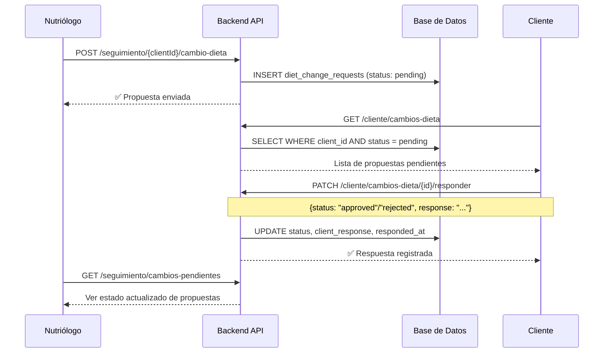

# Módulo de Seguimiento de Pacientes — Nutriólogo

## Contexto

El sistema CloudFit ya cuenta con un módulo de Nutriólogo funcional con Dashboard, Pacientes y Planes Nutricionales. Falta el módulo de **Seguimiento** (marcado como `available: false` en el sidebar).

La visión del usuario es que la interacción sea **como una red social entre clientes, coach y nutriólogo**: los profesionales proponen cambios, el cliente los aprueba, y todo queda registrado en un historial compartido.

---

## Decisiones incorporadas del usuario

| Decisión | Respuesta |
|----------|-----------|
| Fotos de evidencia | ❌ Sin fotos de seguimiento |
| Cambios de dieta | ✅ Requieren aprobación del cliente |
| Gráficas interactivas | ❌ Solo tabla de historial |
| Tabla de progreso | ✅ Compartida entre coach y nutriólogo (campos universales) |
| Campos de medidas | ❌ Sin hip_cm ni medidas detalladas — enfoque social/simple |
| Migraciones | ⚠️ Solo `php artisan migrate` (sin fresh, preservar datos) |

---

## Proposed Changes

### Base de Datos (Migraciones aditivas)

> [!CAUTION]
> Solo se ejecutará `php artisan migrate` para agregar las tablas nuevas. No se tocará la data existente.

---

#### [NEW] `2026_04_22_000001_create_progress_records_table.php`

Tabla **compartida** `progress_records` — usable por coach y nutriólogo:

| Columna | Tipo | Descripción |
|---------|------|-------------|
| `id` | bigint PK | Auto-increment |
| `client_id` | FK → users.user_id | Paciente |
| `author_id` | FK → users.user_id | Quien registra (coach, nutriólogo o el propio cliente) |
| `author_role` | enum(`coach`, `nutriologo`, `cliente`) | Rol del autor |
| `date` | date | Fecha del registro |
| `weight_kg` | decimal(5,2) nullable | Peso en kg |
| `bmi` | decimal(5,2) nullable | IMC calculado |
| `body_fat_pct` | decimal(5,2) nullable | % grasa corporal |
| `muscle_mass_kg` | decimal(5,2) nullable | Masa muscular en kg |
| `calories_target` | int nullable | Calorías objetivo del momento |
| `adherence_pct` | int nullable | % de adherencia (0-100) |
| `notes` | text nullable | Observaciones / comentarios |
| `timestamps` | | created_at, updated_at |

> [!NOTE]
> Se usa `author_id` + `author_role` en lugar de `nutriologo_id` para que la tabla sea universal. Coach, nutriólogo o cliente pueden registrar progreso.

---

#### [NEW] `2026_04_22_000002_create_diet_change_requests_table.php`

Tabla `diet_change_requests` — con flujo de aprobación por el cliente:

| Columna | Tipo | Descripción |
|---------|------|-------------|
| `id` | bigint PK | Auto-increment |
| `client_id` | FK → users.user_id | Paciente que debe aprobar |
| `proposed_by` | FK → users.user_id | Nutriólogo/coach que propone |
| `assignment_id` | FK → nutrition_plan_assignments.id nullable | Asignación relacionada |
| `change_type` | enum | `plan_change`, `meal_update`, `macro_adjust`, `calorie_adjust`, `observation` |
| `previous_value` | json nullable | Snapshot del valor anterior |
| `new_value` | json nullable | Snapshot del valor propuesto |
| `reason` | text | Razón del cambio |
| `status` | enum(`pending`, `approved`, `rejected`) | Estado de aprobación |
| `client_response` | text nullable | Respuesta/comentario del cliente |
| `responded_at` | timestamp nullable | Cuándo respondió el cliente |
| `date` | date | Fecha de la propuesta |
| `timestamps` | | created_at, updated_at |

> [!IMPORTANT]
> **Flujo de aprobación**: El nutriólogo propone un cambio → el cliente lo ve en su panel → el cliente aprueba o rechaza con un comentario opcional. Esto crea una interacción tipo "red social" entre ambos.

---

### Backend — Modelos

#### [NEW] `app/Models/ProgressRecord.php`
- `belongsTo` → User (client), User (author)
- Scopes: `byClient($id)`, `byAuthor($id)`, `byRole($role)`
- Casts: decimals, date

#### [NEW] `app/Models/DietChangeRequest.php`
- `belongsTo` → User (client), User (proposed_by), NutritionPlanAssignment
- Scopes: `pending()`, `byClient($id)`, `byProposer($id)`
- Casts: json para `previous_value`/`new_value`, enum para `status` y `change_type`

---

### Backend — Controlador

#### [NEW] `app/Http/Controllers/Nutriologo/SeguimientoController.php`

| Método | Ruta API | Acción | Descripción |
|--------|----------|--------|-------------|
| GET | `nutriologo/seguimiento/pacientes` | `pacientes` | Lista pacientes con resumen de último registro |
| GET | `nutriologo/seguimiento/{clientId}/historial` | `historial` | Timeline completo: registros de progreso + cambios de dieta mezclados cronológicamente |
| POST | `nutriologo/seguimiento/{clientId}/progreso` | `registrarProgreso` | Nuevo registro de progreso |
| PUT | `nutriologo/seguimiento/progreso/{recordId}` | `actualizarProgreso` | Editar un registro existente |
| DELETE | `nutriologo/seguimiento/progreso/{recordId}` | `eliminarProgreso` | Eliminar un registro |
| POST | `nutriologo/seguimiento/{clientId}/cambio-dieta` | `proponerCambioDieta` | Proponer cambio (queda en `pending`) |
| GET | `nutriologo/seguimiento/cambios-pendientes` | `cambiosPendientes` | Ver estado de propuestas pendientes |

#### [MODIFY] `app/Http/Controllers/Cliente/ClienteController.php`

Agregar endpoints para que el cliente vea y responda a propuestas:

| Método | Ruta API | Acción | Descripción |
|--------|----------|--------|-------------|
| GET | `cliente/cambios-dieta` | `cambiosDieta` | Ver cambios de dieta propuestos |
| PATCH | `cliente/cambios-dieta/{id}/responder` | `responderCambioDieta` | Aprobar o rechazar con comentario |

---

### Backend — Rutas

#### [MODIFY] [nutriologo.php](file:///c:/CloudFit/cloudfit/api-backend/routes/api/nutriologo.php)

Agregar bloque de rutas de seguimiento:

```php
// ── Seguimiento ──
Route::get('/seguimiento/pacientes', [SeguimientoController::class, 'pacientes']);
Route::get('/seguimiento/{clientId}/historial', [SeguimientoController::class, 'historial']);
Route::post('/seguimiento/{clientId}/progreso', [SeguimientoController::class, 'registrarProgreso']);
Route::put('/seguimiento/progreso/{recordId}', [SeguimientoController::class, 'actualizarProgreso']);
Route::delete('/seguimiento/progreso/{recordId}', [SeguimientoController::class, 'eliminarProgreso']);
Route::post('/seguimiento/{clientId}/cambio-dieta', [SeguimientoController::class, 'proponerCambioDieta']);
Route::get('/seguimiento/cambios-pendientes', [SeguimientoController::class, 'cambiosPendientes']);
```

#### [MODIFY] [cliente.php](file:///c:/CloudFit/cloudfit/api-backend/routes/api/cliente.php)

```php
Route::get('/cambios-dieta', [ClienteController::class, 'cambiosDieta']);
Route::patch('/cambios-dieta/{id}/responder', [ClienteController::class, 'responderCambioDieta']);
```

---

### Frontend — Página de Seguimiento (Nutriólogo)

#### [NEW] `resources/js/pages/Nutriologo/Seguimiento.jsx`

Layout de dos paneles siguiendo el mismo patrón visual de Pacientes.jsx:

**Panel izquierdo — Lista de pacientes con seguimiento**
- Búsqueda por nombre/email
- Cada tarjeta muestra: avatar, nombre, último registro (hace cuánto), badge de adherencia con color dinámico
- Indicador visual si hay cambios de dieta pendientes de respuesta

**Panel derecho — Detalle del paciente seleccionado**

1. **Header del paciente**: Nombre, email, estado, plan actual
2. **KPI cards compactas**: Peso actual, IMC, % grasa, adherencia — comparando con el registro anterior (↑ ↓)
3. **Formulario de nuevo registro de progreso**: Campos inline expandibles (peso, IMC, grasa, masa muscular, calorías objetivo, adherencia, notas)
4. **Formulario de propuesta de cambio de dieta**: Tipo de cambio, razón, valores previos/nuevos → se envía como `pending`
5. **Tabla de historial unificada**: Mezcla cronológica de registros de progreso y cambios de dieta, con iconos diferenciadores y badges de estado (`aprobado`, `pendiente`, `rechazado`)
6. **Sección de cambios pendientes**: Lista de propuestas esperando respuesta del cliente, con indicador visual

**Diseño visual**: Sistema de diseño oscuro existente (#0e0e0e, #1a1a1a, #cafd00, #ac8aff, #ff7351) con badges de estado:
- `pending` → amarillo (#fce047)
- `approved` → verde (#7ef0b3)
- `rejected` → rojo (#ff7351)

---

### Frontend — Integración

#### [MODIFY] [NutriologoLayout.jsx](file:///c:/CloudFit/cloudfit/api-backend/resources/js/pages/Nutriologo/NutriologoLayout.jsx)
- Línea 20: Cambiar `available: false` → `available: true` para "Seguimiento"

#### [MODIFY] [app.jsx](file:///c:/CloudFit/cloudfit/api-backend/resources/js/app.jsx)
- Agregar import de `Seguimiento` y ruta `/nutriologo/seguimiento` con `ProtectedRoute`

---

## Resumen de archivos

| Acción | Archivo | Capa |
|--------|---------|------|
| **NEW** | `database/migrations/2026_04_22_000001_create_progress_records_table.php` | DB |
| **NEW** | `database/migrations/2026_04_22_000002_create_diet_change_requests_table.php` | DB |
| **NEW** | `app/Models/ProgressRecord.php` | Backend |
| **NEW** | `app/Models/DietChangeRequest.php` | Backend |
| **NEW** | `app/Http/Controllers/Nutriologo/SeguimientoController.php` | Backend |
| **MODIFY** | `app/Http/Controllers/Cliente/ClienteController.php` | Backend |
| **MODIFY** | `routes/api/nutriologo.php` | Backend |
| **MODIFY** | `routes/api/cliente.php` | Backend |
| **NEW** | `resources/js/pages/Nutriologo/Seguimiento.jsx` | Frontend |
| **MODIFY** | `resources/js/pages/Nutriologo/NutriologoLayout.jsx` | Frontend |
| **MODIFY** | `resources/js/app.jsx` | Frontend |

---

## Diagrama de flujo — Aprobación de cambios de dieta



---

## Verification Plan

### Automated Tests
```bash
# Ejecutar SOLO las migraciones nuevas (NO fresh)
php artisan migrate

# Verificar que las tablas se crearon
php artisan migrate:status

# Verificar rutas registradas
php artisan route:list --path=nutriologo/seguimiento
php artisan route:list --path=cliente/cambios
```

### Manual Verification
- Navegar al sidebar → "Seguimiento" ahora está habilitado y navega correctamente
- Seleccionar un paciente y registrar un progreso → aparece en la tabla de historial
- Proponer un cambio de dieta → queda en estado "pendiente" con badge amarillo
- Verificar que la tabla de historial muestra entradas de progreso y cambios mezclados cronológicamente
